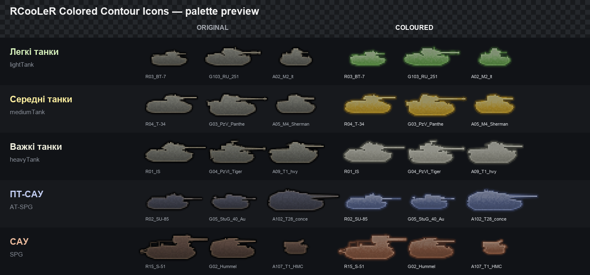

# RCooLeR Colored Contour Icons

Кольорові контурні іконки техніки для World of Tanks у класичній палітрі:

- легкі танки — зелені;
- середні танки — жовто-золоті;
- важкі танки — світло-сірі;
- ПТ-САУ — синьо-сталеві;
- САУ — коричнево-мідні.

Іконки генеруються безпосередньо з ресурсів клієнта. Геометрія та прозорість
оригінальних контурів зберігаються. Основний пакет містить окремі PNG і не має
жорсткої перевірки номера патча: він підтримує гілку World of Tanks 2.x.

Для класичних бойових «вух» збірка також створює окремий, прив'язаний до
поточного патча `battleAtlas`. Він не містить коду й не підміняє SWF: з точного
клієнтського атласу змінюються лише DXT5-блоки контурів машин, а понад мільйон
інших блоків лишаються побітово оригінальними. Цей add-on працює як зі штатною
панеллю, так і зі стандартним профілем XVM.

Назви машин у стабільному варіанті не вбудовуються в атлас. Для XVM лишається
опційний прямий PNG-адаптер, який за окремим параметром може додати назви у
компактні режими; решту налаштувань XVM він не замінює.

Якщо WG додасть нову машину, якої ще немає в пакеті, клієнт використає її
стандартну іконку. Після наступного запуску генератора вона автоматично буде
додана до кольорового набору.

## Попередній перегляд



Повні аркуші всіх іконок зберігаються в `build/previews/` після запуску збірки.

## Завантаження та встановлення

[Завантажити готовий комплект 0.3.3 для WoT 2.4.0.0](https://github.com/RCooLeR/Colored-Contour-Icons/releases/download/v0.3.3/Colored_Contour_Icons_0.3.3_WoT_2.4.0.0.zip)

Закрийте World of Tanks і розпакуйте ZIP у кореневу папку гри зі збереженням
структури каталогів. Архів уже містить обидва потрібні файли у
`mods/2.4.0.0/`. Зовнішніх залежностей мод не має.

Для ручного встановлення скопіюйте обидва файли до
`mods/<поточна версія клієнта>/`:

- `com.rcooler.colored_contour_icons_0.3.3.wotmod` — PNG-пакет для гілки 2.x;
- `com.rcooler.colored_contour_icons_battle_atlas_0.3.3_wg2.4.0.0.wotmod` —
  класичні бойові «вуха» для точно вказаного патча.

Повна назва папки визначається самим WoT; це вимога завантажувача гри. Основний
PNG-пакет розрахований на гілку 2.x, але після зміни клієнтського атласу другий
файл потрібно перебудувати для нового патча.

Або скористайтеся інсталятором, який сам знайде найновішу папку клієнта 2.x:

```powershell
.\tools\install.ps1 -GameRoot 'D:\Games\World_of_Tanks'
```

Інсталятор за замовчуванням не змінює XVM-конфіг: стандартний XVM і штатний
клієнт обидва читають встановлений `battleAtlas`. Прямий XVM-адаптер потрібен
лише для нестандартних iconset-профілів; його можна встановити параметром
`-InstallXvmDirectAdapter`, а назви додати через `-IncludeXvmNames`.

Клієнтський `playersPanel.swf` не підміняється: цей експериментальний шлях був
видалений після несумісності з бойовим інтерфейсом.

Інструкції зі збірки та технічні деталі наведено у [DEVELOPERS.md](DEVELOPERS.md).
